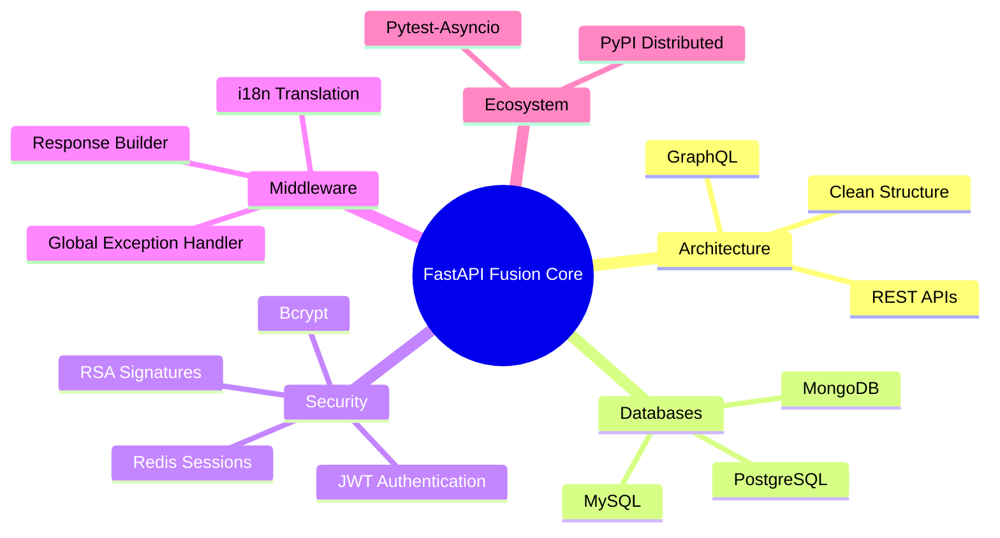

# 🚀 FastAPI Fusion Core - Developer Portfolio Showcase

**FastAPI Fusion Core** is a premium, enterprise-grade Python backend framework designed to provide an out-of-the-box, highly scalable architecture for complex applications. Developed from the ground up to solve modern full-stack challenges, it seamlessly integrates REST APIs, GraphQL, robust authentication, and true asynchronous multi-database support.

This document serves as a comprehensive technical breakdown of the architecture, features, and engineering decisions behind the project.

- **Author**: shaijujin ([shaijujiny@gmail.com](mailto:shaijujiny@gmail.com))
- **Portfolio**: [https://shaijujin.github.io/shaiju-john/](https://shaijujin.github.io/shaiju-john/)
- **GitHub Repository**: [https://github.com/Shaijujiny/fastApiRoot.git](https://github.com/Shaijujiny/fastApiRoot.git)
- **PyPI Package**: [https://pypi.org/project/fastapi-fusion-core/](https://pypi.org/project/fastapi-fusion-core/)

---

## 🛠️ 1. Technical Stack & Foundation

At its core, the application is built using the fastest and most modern async Python ecosystem:
- **Web Framework**: FastAPI, Uvicorn, Starlette
- **Data Validation**: Pydantic V2
- **Databases**: PostgreSQL, MySQL, MongoDB
- **GraphQL**: Strawberry GraphQL
- **Authentication**: JWT (JSON Web Tokens), Redis, Passlib, Bcrypt
- **Testing**: Pytest, Pytest-Asyncio, HTTPX
- **Packaging**: Built natively with Setuptools and distributed as a PyPI CLI package.

---

## 🏗️ 2. Premium Enterprise Architecture

The codebase strictly follows a clean architecture model, separating concerns into highly maintainable domains.

### Directory Breakdown
- **`app/api/`**: Contains route definitions (`router.py`), data validation (`schema.py`), and business logic (`service.py`).
- **`app/core/`**: Houses global middleware, standard response builders, and unified error handler configurations.
- **`app/database/`**: Dedicated connection managers and session makers for each independent database engine.
- **`app/depends/`**: Reusable FastAPI dependency injections (e.g., fetching DB sessions, validating tokens).
- **`app/models/`**: ORM definitions mapping directly to tables/collections.

This structure allows development teams to instantly unblock themselves when scaling, allowing micro-service extractions without deep refactoring.

---

## 🗄️ 3. Multi-Database Mastery (Fully Asynchronous)

Unlike standard boilerplates that bind you to a single database, **FastAPI Fusion Core** natively connects to three major database systems simultaneously, all using native asynchronous drivers to prevent blocking the I/O event loop.

1. **PostgreSQL**: Connected via `SQLAlchemy 2.0` and `asyncpg`. Perfect for primary relational user data and secure transaction management.
2. **MySQL**: Connected via `SQLAlchemy 2.0` and `aiomysql`. Included for legacy compatibility or specific architectural read/write replicas.
3. **MongoDB**: Connected natively via `Motor`. Used for flexible schema storage, such as product catalogs, logging, or unstructured JSON payload storage.

### Data Injection & Safety
Each API route injects the specific database context using FastAPI's `Depends()`. 
*Example:* `async def get_users(db: AsyncSession = Depends(get_postgres_db)):`
When transactions fail or exceptions are raised (such as a database connection drop), the global middleware automatically rolls back the transaction safely.

---

## 🔐 4. Advanced Security & JWT Authentication

Stateless authentication using standard JWT is great but cannot be revoked if a token is compromised. To solve this, **FastAPI Fusion Core** implements a robust hybrid auth model.

- **RSA Public/Private Key Signing**: Tokens are cryptographically signed to guarantee no tampering.
- **Redis Integration**: When a user logs in, the active session state is written to a fast Redis cache. Every secured route checks the Redis state validator. If an admin bans the user or the user clicks "Log out everywhere," their Redis session is instantly invalidated, locking out the active JWT token immediately.
- **Password Hashing**: Uses `passlib[bcrypt]` to securely digest passwords before they even touch the database.

---

## 🛡️ 5. Unified Error & Message Handling

In typical APIs, an HTTP 404 might look completely different than an HTTP 500 or a Pydantic Validation error. **FastAPI Fusion Core** intercepts **all** outbound errors globally using custom Exception Middleware.

Whether the app throws a generic exception, a missing database catalog error (`InvalidCatalogNameError`), or a syntax validation failure, the user will *always* receive a strict JSON contract formatted by the `ResponseBuilder`:

```json
{
  "status": -1,
  "error_type": "INTERNAL_SERVER_ERROR",
  "message": "Internal server error",
  "status_code": 500,
  "data": {
    "detail": "Database Initialization Error: Table Creation Error..."
  }
}
```

### Internationalization (i18n) Ready
Every response incorporates an `Accept-Language` header parser. Success and error mappings pass through an internal dictionary format, meaning the framework natively supports translating error messages before rendering the JSON result.

---

## 📊 6. Native GraphQL Integration

Alongside standard REST architecture, the platform includes a fully featured GraphQL endpoint running on Strawberry (`/graphql`). 
- **Shared Context**: The GraphQL queries read the exact same authentication `BaseContext` logic as REST.
- **Resolver Architecture**: Queries and Mutations are dynamically generated and utilize the same internal database and service utilities created for REST, ensuring "write once, deploy twice" logic paths.

---

## 📦 7. The PyPI CLI Engine

To transform the framework from a normal local repository into a distributable tool, the entire app is packaged using `pyproject.toml` and `setuptools`.

This allows developers to securely download the template from PyPI using:
```bash
pip install fastapi-fusion-core
fastapi-fusion create new_project_name
```
A custom `cli.py` engine hooks into the terminal, injects into the OS PATH, and recursively clones the optimized template. 

---

## 💡 Engineering Highlights

* **Lifespan Handlers**: Upgraded from older `@app.on_event("startup")` architecture to modern, safe `@asynccontextmanager` lifespans for stable database ignition/teardown.
* **PyTest Asyncio**: Built-in HTTPX ASGITransport client designed to rigorously test all routes synchronously without needing to boot a live physical port.
* **Strict Code Quality**: Eliminates hidden Python crashes, leveraging deep Type Hinting across the entire data layer. 

---

## 🧠 Logical Mind Map



Built for performance. Built for production.
